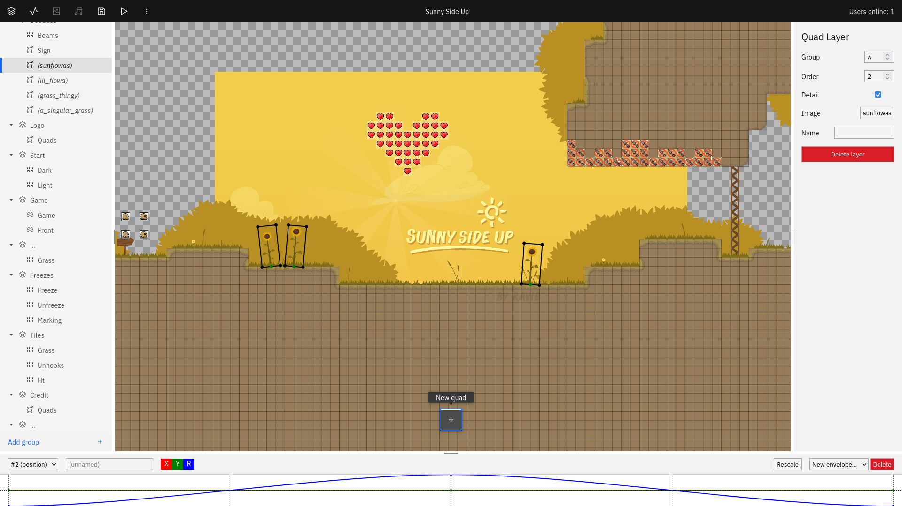

# Teeworlds Web Editor (TWWE)

Teeworlds / DDraceNetwork map editor. Online and collaborative, just like the game.

A demo server is hosted at [tw.thissma.fr](https://tw.thissma.fr).

## Development Status (Sep. 2023)

The app is now mostly compatible with ddnet editor.
Bugs are expected. It is advised to save regularly and if a bug happens, log out and back in to roll back to the previous save.
Maps corruptions are unlikely to happen though thanks to @patiga's [twmap library](https://gitlab.com/Patiga/twmap).

### DDNet Compatibility

The table below shows the feature parity with ddnet's in-game map editor.

|                 | Support | Comment                                                                               |
|-----------------|---------|---------------------------------------------------------------------------------------|
| Groups          | ✅      |                                                                                       |
| Layers          | ✅      |                                                                                       |
| Images          | ✅      | Image tab planned                                                                     |
| Envelopes       | ✅      | UX needs improvement                                                                  |
| Sounds          | ❌      | Not planned                                                                           |
| Map details     | ✅      |                                                                                       |
| Tiles           | 🆗      | Missing: Shift tiles, Auto game tiles                                                 |
| Quads           | 🆗      | Missing: Slice, Square, Align, Aspect ratio                                           |
| Automappers     | ✅      |                                                                                       |
| Server settings | 🆗      | Better support for server settings planned (#77)                                      |
| Misc. Tools     | ❌      | Missing: Append map, Allow/Remove unused, Destructive, Refocus, Goto, Place border    |
| Misc. display   | ❌      | Missing: Tile info, Grid, Proof, High detail, Zoom                                    |

### Unique features

 * Collaborative editing
 * Automapper edit and live-preview
 * Rules++ support (experimental)

### Roadmap to 1.0

 * Desktop client
 * Server bridging
 * sync with ddnet server / reload-on-save (#21)
 * Map passwords and permissions
 * Undo / Redo history (#31)
 * More tools: Proof, Quad tools
 * Bug squashing

## Usage

Explore the UI, it resembles the ddnet editor for the most part.

Key/Mouse bindings:
 * Zoom in/out -> mouse wheel
 * Pan around -> `ctrl+left_click+drag` or `wheel_button+drag`
 * Place tiles -> `left_click+drag`
 * select a range of tiles -> `shift+left_click+drag`
 * Open tile picker -> hold `space_bar` and `left_click+drag` to select tiles
 * Flip brush horizontally / vertically -> `h` / `v`
 * Rotate brush clockwise / counterclockwise -> `r` / `shift+r`
 * Toggle layers view / envelope view -> `tab`
 * Save map -> `ctrl+s`
 * `right_click` opens context-menus on quad points, envelope points and envelope lines.
 * Select multiple layers with `shift`.

The Save button saves the map on the disk on the server side. If a teeworlds server using this map is running, enter `reload` in the server console to update it.

## Building and Running

The code is split into a client and a server part. The client generates a static site (html, js, …) that you can host wherever you want or even run locally. The server is a WebSocket server that the client connects to. The maps are stored on the server machine.

### Server

Have [rust](https://www.rust-lang.org/) and cargo installed. And create a server/maps/ directory with your .map files in it.

Run the server with `RUST_LOG=debug cargo run --release` to run in release mode with debugging info printed to stdout.

Use the first command-line argument to change address and port e.g. `cargo run localhost:3333` to run locally on port 3333.

Use the `--cert` and `--key` flags to enable TLS support for websocket. They must point to your PEM certificate and private key.

Use the `--rpp <path>` flat to enable Rules++ support (experimental). `<path>` must be the **absolute** path to a directory containing: `rpp` (the rpp executable), `base.r` and `base.p`.

### Client

Copy the `env.example` file to `.env` or `.env.production` and configure the websocket server url. For a TLS-encrypted websocket, the url schemes are `wss://` and `https://`. Otherwise, use `ws://` and `http://`.

Have [npm](https://www.npmjs.com/) installed and run `npm install` in the client directory to install dependencies, `npm run dev` to run a dev server and `npm run build` to produce a release in the `dist` directory.

Note: the client is written in non-strict Typescript. Typescript is only used for IDE hints and documentation, but ignored by the [Vite](https://vitejs.dev/guide/features.html#typescript) bundler.
Use `npm run check` to run Typescript checks on the project.

## License

This work is licensed under the GNU Affero General Public License v3.0 (agpl). You are free to use and modify the code and executables under some conditions. Please contact me if the license doesn't fit your needs.
